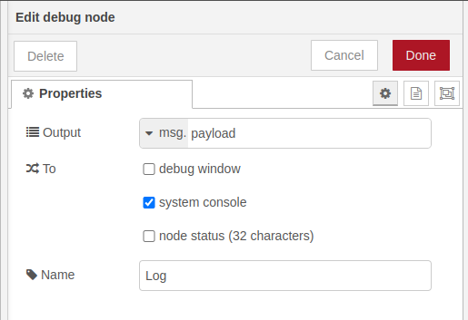
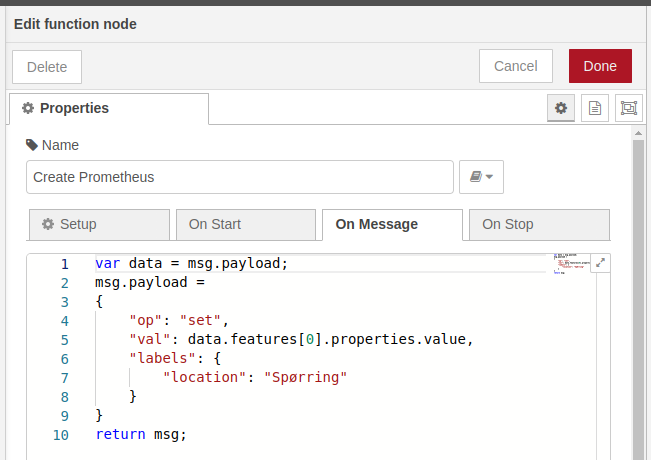
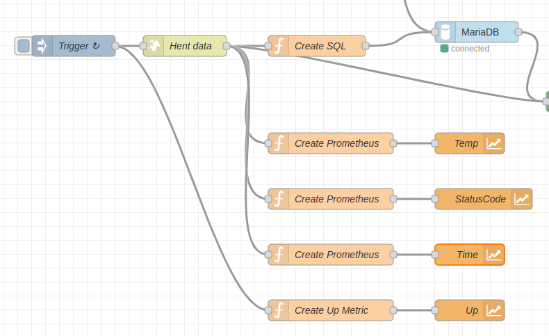
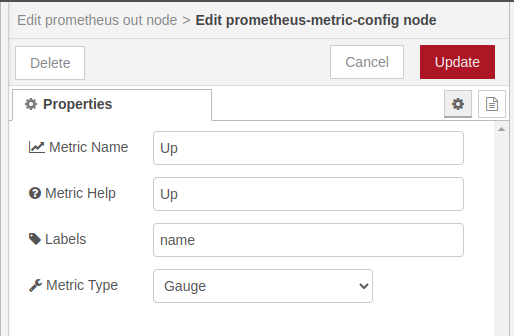
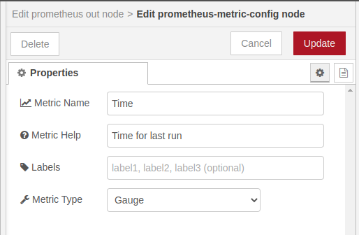

# Node-RED template-projekt
Template til nye Node-RED projekter.
Projekt indeholder en tom Node-RED og paletterne
* node-red-contrib-mysql-config
* node-red-contrib-prometheus-exporter

# Brug af node-red-template
1. Klik "use this template -> create a new repository"
2. Udfyld skærmbillede med information om den nye service
3. Åbn dit nye git projekt

# 'Mit' Node-RED projekt
Nedenstående relaterer sig til et nyt Node-RED projekt der er baseret på denne template.

## Lokalt udviklingsmiljø
> docker-compose up --build

Starter et lokalt docker-compose miljø, der bygger og starter Node-RED og en mariadb.

Ved byg af Node-RED kopieres følgende filer ind i containeren:
* [node-red/package.json](node-red/package.json)
* [node-red/settings.js](node-red/settings.js)
* [node-red/flows_cred.json](node-red/flows_cred.json)
* [node-red/flows.json](node-red/flows.json)
<br>

### Udvikling
Når flowet er færdigudviklet skal det eksporteres til [node-red/flows.json](node-red/flows.json).
<br>
Dette gøres ved at klikke i node-red menuen
* menu -> Export -> Current Flow -> Copy to clipboard. 

Herefter erstattes indholdet i 'flows.json' med det kopierede indhold.

### Tilføjelse af Palette / Dependencies
Er der behov for at tilføje udvidelser ifm. det udviklede flow, kan disse installeres dynamisk via Node-RED menuen
* menu -> Manage palette.

For at gøre tilføjelsen permanent skal den tilføjes til filen [node-red/package.json](node-red/package.json) under 'dependencies'. Her tilføjes navnet på udvidelsen og version der ønskes.
<br>

### Logs og metrikker
Skrivning til log gøres med 'debug'-noden, der sættes til at sende log til 'system console'.
<br>


Udstilling af metrik gøres med 'prometheus out'-noden, som er en del af paletten 'node-red-contrib-prometheus-exporter'.
<br>
Det er muligt at udstille metrikker som Prometheus kan scrape og efterfølgende vise i Grafana. 
Input til metrikken kommer fra en function-node der beskriver metrikken.
<br>


### Anbefalede minimums metrikker
For at servicen automatisk bliver tilføjet til Grafana dashboardet [*Service*](https://grafana.t0.hosting.kitkube.dk/d/ZxQiUL0Vz/service?orgId=125), skal følgende metrikker som minium være udstillede.   

- Up *- Indeholder værdien 1 når node-red servicen kører*
- StatusCode *- Indeholder seneste HTTP status kode fra API-kald*
- Time *- Indeholder tidspunket for seneste kørsel*

Følgende er et eksempel på hvordan metrikkerne kan opsættes. 



**Up**  
Funktionen føres over til *prometheus out* node
```
msg.payload =
{
    "op": "set",
    "val": 1,
    "labels": {
        "name": env.get('POD_NAME')
    }
}
return msg;
```


**StatusCode**   
Funktionen føres over til *prometheus out* node   
```
var statusCode = msg.statusCode;
msg.payload =
{
    "op": "set",
    "val": statusCode,
}
return msg;
```


**Time**   
Funktionen føres over til *prometheus out* node   
```
var time = new Date();
msg.payload =
{
    "op": "set",
    "val": time,
}
return msg;
```



## Udgivelse af version
Ved push til Github, bliver der bygget et docker image. Hvis bygget går godt bliver docker imaget pushet til [GitHub packages](https://github.com/orgs/Randers-Kommune-Digitalisering/packages) med version tag svarede til commit id'et. 

### Release
```
git tag v1.0.0
git push origin --tags
```

Når der skal laves en release oprettes et git tag. Tagget skal være på formen v*.*.* fx v1.2.3.
<br>
Når et tag pushes til Github bygges en version med tagget og gemmes under packges på Github.
